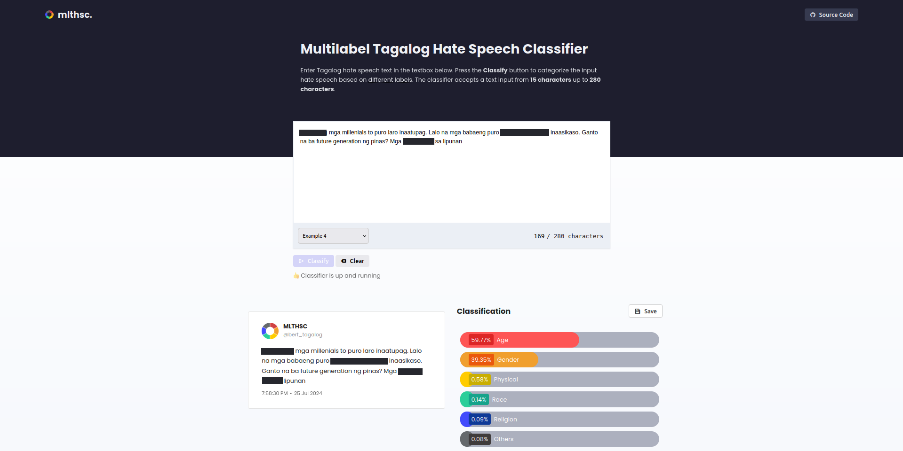
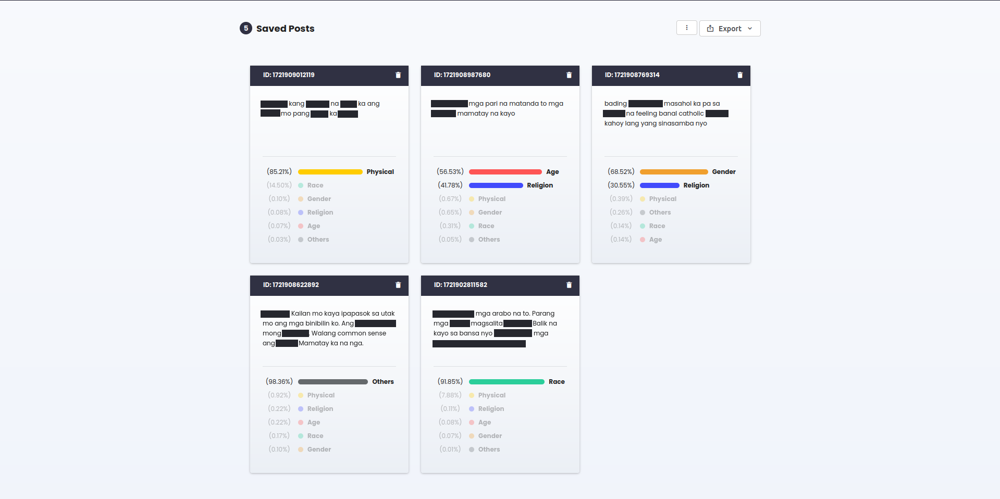

# MLTHSC Javascript Web App (v2)

Now works online!

Here contains all related files for reworking the javascript-based web app for the project Multilabel Tagalog Hate Speech Classifier (MLTHSC) including the notebooks for retraining the classifier model. 

(v1): [GitHub: syke9p3/mlthsc-thesis](https://github.com/syke9p3/mlthsc-thesis)

  
  

This project started as a college thesis proposal - a hate speech classifier that could classify Tagalog text based on different categories like age, gender, physical, etc. 

Our time was mostly spent on writing the manuscript, gathering text data, implementing the software architecture of our model, training, testing, etc. Time was running short for the upcoming defense at that time that's why we had to build something fast - a simple user interface that would demonstrate the functionality to the panelists. 

## What changed? 

- now works online (even on mobile)
- deployed on [GitHub Pages](https://syke9p3.github.io/retrain-mlthsc/)
- hosted the classifier model on [Hugging Face](https://huggingface.co/syke9p3/bert-multilabel-tagalog-hate-speech-classifier)
- model was [quantized](https://huggingface.co/docs/optimum/en/concept_guides/quantization) because the loading the original larger model in the application would take too long to actually perform the classifications. This was the challenge we had from the start when trying to deploy the model online.  
- refactored Javascript code to make adding features faster
- changed input limit from *between 3 to 280 words* to *between 15 to 280 characters*
- added "last classified text" section
- enhanced appearance of saved post cards
- changed the appearance of the buttons
- outlines for accessibility
- FAQ section
    - overview of the tool
    - definitions for each labels
    - how the classifier works
- source code link

## Still working on

- features section in FAQ
- filtering
- pagination
- dark mode (restructuring CSS)
- implementing accessibility (ARIA) standards
- might try to rewrite this again in React

## Some notes (things I learned)

- I just recently learned about the concept of *dependency injection* (DI) while working on this project after I had already implemented global state in the app. I am using a global state because the previous iteration of this project didn't so while the codebase was growing it was hard to track changes between the states of the UI and side-effects. However, as I was reworking the project I am directly using the global state inside the functions, which I recently learned was bad practice. It makes unit testing difficult since the function can't know in advance the values held by the global state. I read a response Stackoverflow that says instead of the functions looking for dependencies, inject them instead into the function (pass the state as an argument). This way, it's easier to test because mock data can be inserted as opposed to being hidden away in a global state.

<!-- 

# Features

Automated Detection

Multilabel Classification

Tagalog Language-Specific

Report Generation

 -->